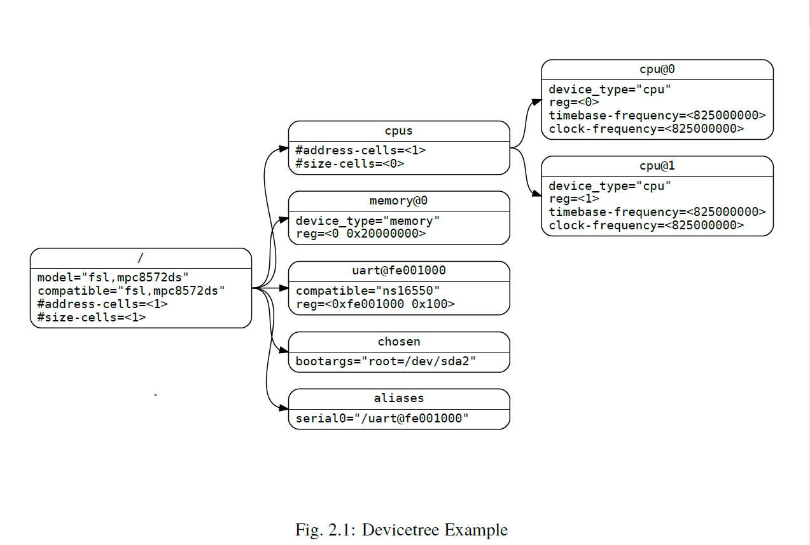
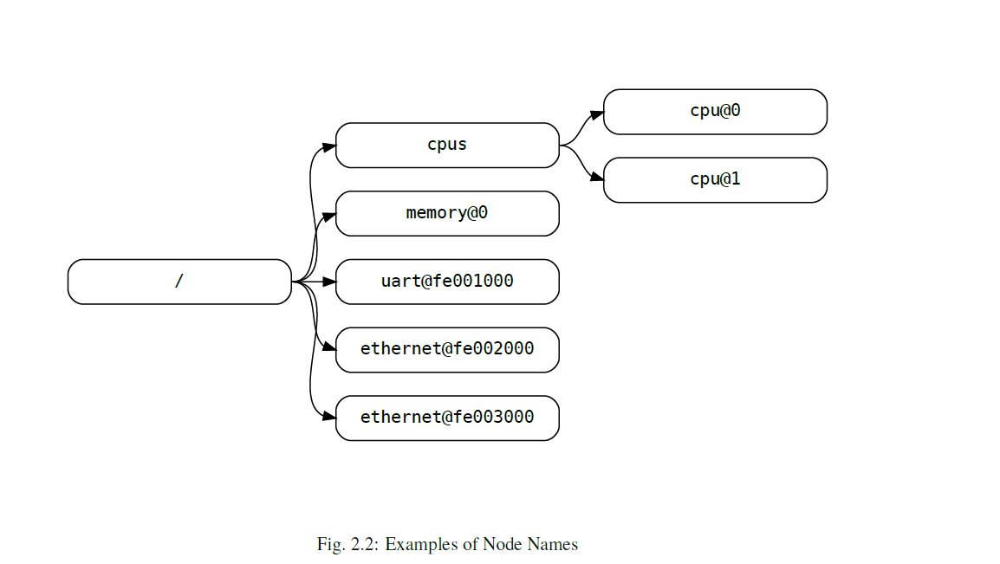
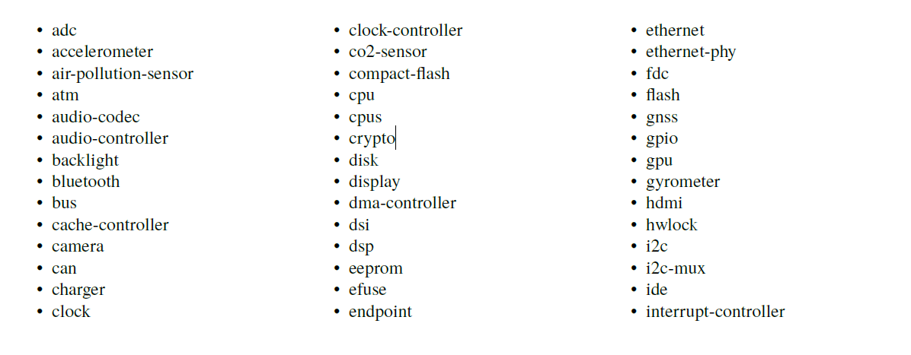
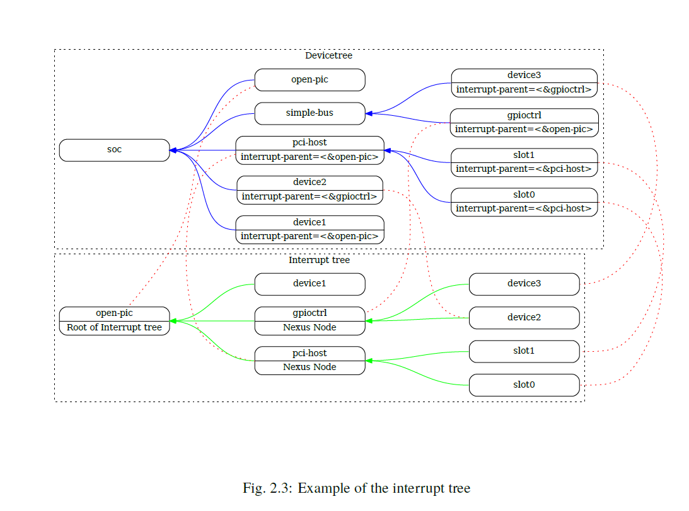

<p align = "center"><b>
    Devicetree Specification
</b></p>
<p align = "center">
    <b>
        <a href="ch01.md">上一章</a>
        -
        <a href="../README.md">目录</a>
        -
        <a href="ch03.md">下一章</a>
    </b>
</p>

---

## 2设备树

### 2.1概述

DTSpec 指定了一种称为设备树的结构来描述系统硬件。引导程序加载设备树到这client程序的内存中并把指向设备树的指针传给client程序。

本章节主要内容为设备树的逻辑结构和用于描述设备节点的基本属性。第3章规定了符合DTSpec（设备树规范）的设备树所需的某些设备节点。第4章描述了DTSpec定义的设备绑定——表示某些设备类型或类别的要求。第5章描述了设备树的内存编码方式。

设备树是一个树形的数据结构，它的节点描述了系统中对应的设备。每个节点用property/value来描述设备的特性，并且除了root根节点以外，每个节点都有唯一的父节点。

设备树中描述的设备可能是实际的硬件设备，例如 UART。他也可能是硬件设备的一部分，例如 TPM 中的随机数生成器。它也可能是通过虚拟化提供的设备，例如提供对连接到远程 CPU 的 I2C 设备的访问的协议。设备还可能包括由固件在更高权限级别或远程处理器上实现的功能。设备树中的节点不一定是物理硬件设备，但通常它们与物理硬件设备有某种关联。节点不应为特定于操作系统或项目的目的而设计，而应描述任何操作系统或项目都能实现的内容。

设备树通常用于描述客户端程序无法动态检测的设备。例如，PCI架构允许客户端通过探测来检测连接的设备，因此描述PCI设备的设备树节点可能并不是必须的。然而，设备节点通常用于描述系统中的PCI主桥设备。如果桥设备无法通过探测检测到，则该节点是必需的，否则它是可选的。此外，引导加载程序可能会进行PCI探测，并生成包含扫描结果的设备树，以传递给操作系统。

**例如**

**图2.1**显示了一个简单的设备树的示例表示，该设备树几乎足够完整，可以启动一个简单的操作系统，其中描述了平台类型、CPU、内存和单个 UART。设备节点是以属性和值表示的。



### 2.2 设备树结构和约定

#### 2.2.1 节点名

**节点命名规则**

设备树中的每个节点都按照以下约定命名:

> node-name@unit-address

其中`node-name`描述了节点的名字。它必须由1到31个有效字符(见表2.1)组成。

<p align = "center"><b>表2.1 有效字符</b></p>

| 字符 | 0 - 9 |  a - z   |  A - Z   |  ,   |   .    |   _    |  +   |   -    |
| :--: | :---: | :------: | :------: | :--: | :----: | :----: | :--: | :----: |
| 描述 | 数字  | 小写字母 | 大写字母 | 逗号 | 小数点 | 下滑线 | 加号 | 破折号 |

`node-name`必须以字母开头且应描述对应设备的类型。

`unit-address`明确了节点所在总线的位置。它由一个或多个表2.1中的`ASCII`字符组成。`unit-address`必须与节点的`reg`属性中的首地址匹配。如果节点没有`reg`属性，`unit-address`必须被省略且`node-name` 不能与同级其它`node-name`相同。特定总线的绑定可能会对`reg`和`unit-address`的格式有其他更多具体的要求。

如果节点名称没有@unit-address，则节点名称对于树中同一级别的任何属性名称应是唯一的。

root根节点没有`node-name`和`unit-address`，它用`/`表示。  



<p align="center"><b>图2.2 节点名举例</b></p>

图2.2：

- 图中名为cpu的节点通过`unit-address`的值0和1来区分
- 图中名为ethernet的节点通过`unit-address`的值`fe001000`和`fe003000`来区分


#### 2.2.2 推荐的通用命名

节点名应该尽可能的通用且能反映出设备的功能，而不是精确的编程模型。如果合适，应该从下面的名字中选择一个：




#### 2.2.3 路径名

设备树中的节点可以通过指定从根节点开始的完整路径来唯一标识，通过所有后代节点，到达所需节点。

指定设备路径的约定是：

> /node-name-1/node-name-2/node-name-N

例如，图2.2中`cup#1`的路径是：

> /cpus/cpu@1

这路径的根节点是`/`。

如果对于节点的绝对路径没有争议，那么`unit-address`可以被省略。

如果一个`Client Program`遇到一个模棱两可的路径，它的行为将是未定义的。


#### 2.2.4 属性

设备树中的每个节点都有属性来描述节点的特性。属性由名字和值组成。

**属性名**

属性名由**表2.2**中字符组成的长为1～31的字符串。

<p align = "center"><b>表2.2 属性名的有效字符表</b></p>

| 字符 | 0 - 9 |  a - z   |  A - Z   |  ,   |   .    |   _    |  +   |   -    |  ？  | #    |
| :--: | :---: | :------: | :------: | :--: | :----: | :----: | :--: | :----: | :--: | ---- |
| 描述 | 数字  | 小写字母 | 大写字母 | 逗号 | 小数点 | 下滑线 | 加号 | 破折号 | 问号 | #号  |

非标准属性名称应指定唯一的字符串前缀，例如具有辨识度的公司或组织名来定义属性。例如：

```
fsl,channel-fifo-len
ibm,ppc-interrupt-server#s
linux,network-index
```

**属性值**

属性值是零个或多个字节的数组，其中包含与属性相关的信息。

如果它表达的是true-false信息，那么它可能是一个空值。

表 2.3 描述了 DTSpec 定义的一组基本值类型。

<p align = "center"><b>表2.3：属性值</b></p>


|      值       |                             描述                             |
| :-----------: | :----------------------------------------------------------: |
|   \<empty>    | 值是empty。用来表示这个属性它自己是否存在的真假(true-false)信息。 |
|    \<u32>     | big-endian格式的32位整数。例如32位值 0x11223344 在内存中的形式为: |
|               |                          address 11                          |
|               |                         address+1 22                         |
|               |                         address+2 33                         |
|               |                         address+3 44                         |
|    \<u64>     | big-endian格式的64位整数，它由两个\<u32>组成，其中第一个值包含整数的最高有效位，第二个值包含最低有效位。例如0x1122334455667788将被表示为2个单元:<0x11223344 0x4455667788> 它在内存中的形式为： |
|               |                          address 11                          |
|               |                         address+1 22                         |
|               |                         address+2 33                         |
|               |                         address+3 44                         |
|               |                         address+4 55                         |
|               |                         address+5 66                         |
|               |                         address+6 77                         |
|               |                         address+7 88                         |
|   \<string>   | 字符串是可打印的字符并且以 null 结尾。例如"hello"它在内存中的形式为： |
|               |                         address 'h'                          |
|               |                        address+1 'e'                         |
|               |                        address+2 'l'                         |
|               |                        address+3 'l'                         |
|               |                        address+4 'o'                         |
|               |                        address+5 '\0'                        |
|  \<phandle>   | \<u32> 值。 phandle 值是引用设备树中另一个节点的一种方式。任何可以引用的节点都会定义具有唯一 \<u32> 值的 phandle 属性。该数字用于具有 phandle 值类型的属性。 |
| \<stringlist> | 由多个\<string>组成的字符串列表。如"hello","world",他在内存中的形式为： |
|               |                         address 'h'                          |
|               |                        address+1 'e'                         |
|               |                        address+2 'l'                         |
|               |                        address+3 'l'                         |
|               |                        address+4 'o'                         |
|               |                        address+5 '\0'                        |
|               |                        address+6 'w'                         |
|               |                        address+7 'o'                         |
|               |                        address+8 'r'                         |
|               |                        address+9 'l'                         |
|               |                        address+10 'd'                        |
|               |                       address+11 '\0'                        |


### 2.3 标准属性

DTSpec 为设备节点指定了一些标准属性。本节将详细描述这些属性。由 DTSpec 定义的设备节点（见第 3 章）可能对标准属性的使用提出额外的要求或限制。第 4 章描述了特定设备的表示，也可能指定附加要求。

> 注意: 在本文档中所有设备树节点的示例中对其节点和属性的描述都使用DTS(Devicetree Source)格式。
>
> 

#### 2.3.1 compatible

属性名：`compatible`

值类型：`<stringlist>`

描述：

`compatible`属性值由一个或多个字符串组成，为设备定义了特定的编程模式。客户端程序应使用此字符串列表进行设备驱动程序的选择。属性值由一系列以null结尾的字符串组成并且从左到右为具体到一般，即左边的字符串的含义为右边的子集。他们允许设备表达其与一组相似设备的兼容性，从而可能使单个设备驱动程序匹配多个设备。

推荐的格式是"manufacturer,model",这里的`manufacturer`是一个描述制造商的字符串(例如股票代号)，`model`表明了对应的型号。

举例:

```dtd
compatible = "fsl,mpc8641", "ns16550";
```

在这个例子中一个操作系统将先去查找支持`fsl,mpc8641`的设备驱动。如果没有找到，它将继续查找支持更通用的`ns16550`设备类型的驱动程序。


#### 2.3.2 model

属性名：model

值类型：`<string>`

描述：

model 属性的值是一个 \<string\>，用于指定设备的制造商型号。

推荐的格式是"manufacturer,model"。`manufacturer`是一个描述制造商的字符串(例如股票代号)，`model`表明了对应的型号。

举例:

```dtd
model = "fsl,MPC8349EMITX"
```


#### 2.3.3 phandle（不常用）

属性名：phandle

值类型：`<u32>`

描述：

`phandle`属性是节点在设备树中的唯一标识(id)。通常它的值被其他节点使用，来表示对它的引用。

举例：

  观察下面的devicetree的截取部分：

```dtd
pic@10000000 {
    phandle = <1>;
    interrupt-controller;
    reg = <0x10000000 0x100>;
};
```

phandle的值是1。另外一个设备节点能够用phandle的值引用pic节点。

```dtd
another-device-node {
	interrupt-parent = <1>;
};
```


> **注意**：可能会遇到旧版本的设备树，其中包含此属性的已弃用形式，称为 linux、phandle。为了兼容性，如果 phandle 属性不存在，客户端程序可能希望支持 linux,phandle。这两个属性的含义和用途是相同的。


> **注意：** 大多在DTS中的devicetrees（看附录A）不包含显式的phandle属性。DTC工具会在DTS编译为DTB时候自动插入phandle属性。


#### 2.2.4 status

属性名：status

值类型：\<string>

描述：

status 属性表示设备的运行状态。缺少 status 属性应被视为该属性存在且值为 "okay"。有效值如下表2.4。

<p align = "center"><b>表2.4：status属性值</b></p>

|     值     |                             描述                             |
| :--------: | :----------------------------------------------------------: |
|   "okay"   |                       设备是可操作状态                       |
| "disabled" | 表明当前不可操作，但未来可能变成可操作的(例如：一些没插入或未关闭)。特定设备的disabled 情参考设备绑定 |
| "reserved" | 表明设备可操作但不应该使用。典型的是设备的使用是通过其他软件组件控制的，如平台固件 |
|   "fail"   |  表明设备不可操作。探测到设备出错并不可能修复变成可操作状态  |
| "fail-sss" |              同上，并`sss`表明错误条件被检测到               |


#### 2.2.5 #address-cells 和 #size-cells

属性名：`#address-cells`,`#size-cells`

值类型：\<u32>

描述：

`#address-cells` 和 `#size-cells` 属性可以用于设备树层级中任何具有子节点的设备节点中，描述如何对子设备节点进行寻址。`#address-cells`：指定用于表示子节点地址的单元（32位值）的数量, `#size-cells` ：指定用于表示子节点占用的内存或I/O区域大小的单元数量。

`#address-cells`,`#size-cells`属性不能从祖先节点继承，必须显示定义。

DTSpec-compliant规范boot程序应该在所有具有子节点的节点上提供`#address-cells` 和`#size-cells`。

如果缺少这些属性，客户端程序应假定 `#address-cells` 的默认值为 2，`#size-cells` 的默认值为 1。

举例：

```dtd
soc {
    #address-cells = <1>;
    #size-cells = <1>;

    serial@4600 {
        compatible = "ns16550";
        reg = <0x4600 0x100>;
        clock-frequency = <0>;
        interrupts = <0xA 0x8>;
        interrupt-parent = <&ipic>;
    };
};
```

例子中soc节点中`#address-cells`,`#size-cells`都设置为1。此设置指定表示该节点的子节点的地址需要一个单元，表示大小也需要一个单元。

串行设备 reg 属性必须遵循父 (soc) 节点中设置的此规范-----用一个单元(0x4600)表示地址和用一个单元(0x100)表示大小


#### 2.2.6 reg

属性名：`reg`

属性值：`<prop-encoded-array>`  把 (address, length) '键值对'编码/组成数组。

描述：

`reg` 属性描述了设备资源在其父总线定义的地址空间中的地址。通常表示IO寄存器块内存映射的偏移地址和长度，但在一些总线类型上可能有不同的含义。root节点在地址空间中定义的地址是CPU实地址。

该值是一个 `<prop-encoded-array>`，由任意数量的地址和长度对组成。`<address, length>`其中`address`和`length`是由总线指定的以`<32u>`类型为单元的数据，并且是由该设备节点的父节点中 `#address-size` `#size-cells`属性来描述。如果父节点中`#size-cells`的值是0，那么`reg`属性中的 `length`域应该被省略。

举例：

假设一个设备在片上系统上有两个寄存器块，它们在SOC上的偏移地址和大小分别为`(0x3000, 0x20)`, `(0xFE00 0x100)`。这`reg`属性将被编码成如下形式(假设`#address-size` `#size-cells`的值都是1)：

```dtd
reg = <0x3000 0x20 0xFE00 0x100>
```


#### 2.3.7 virtual-reg

属性名：`virtual-reg`

值类型：`<u32>`

描述：

`virtual-reg` 属性指定一个有效地址，该地址映射到设备节点的 `reg` 属性中指定的第一个物理地址。此属性使启动程序能够向客户端程序提供已经设置好的物理地址映射。


#### 2.3.8 ranges

属性名：`ranges`

值类型：`<empty>` 或 `<prop-encoded-array>` 编码成`(child-bus-address,parent-bus-address,length)`形式的三元组

描述：

range 属性提供了一种定义总线地址空间（子地址空间）和总线节点父节点地址空间（父地址空间）之间映射或转换的方法。
`ranges` 属性的值格式是任意数量的三元组 `(child-bus-address,parent-bus-address,length)` 组成。

- `child-bus-address` 是子总线地址空间的物理地址。表示地址所需的单元数量取决于总线，可以从该节点（即 `ranges` 属性所在的节点）的 `#address-cells` 中确定。。

- `parent-bus-address`是父总线地址空间的物理地址。表示父地址所需的单元数量取决于总线，可以从定义父节点地址空间的节点的 `#address-cells` 属性中确定。

- `length` 是子地址空间范围的长度，表示大小所需的单元数量可以从该节点（即 `ranges` 属性所在的节点）的 `#size-cells` 属性中确定。。

如果该属性被定义为`<empty>`，则表明父地址空间和孩子地址空间是一样的，并且没有地址转换要求。

如果在总线节点中未包含该属性，则假定该节点的子节点与父地址空间之间不存在映射。

**地址转换例子：**

``` dtd
soc {
    compatible = "simple-bus";
    #address-cells = <1>;
    #size-cells = <1>;
    ranges = <0x0 0xe0000000 0x00100000>;
    
    serial@4600 {
        device_type = "serial";
        compatible = "ns16550";
        reg = <0x4600 0x100>;
        clock-frequency = <0>;
        interrupts = <0xA 0x8>;
        interrupt-parent = <&ipic>;
    };
};
```

soc节点的range属性的值是`<0x0 0xe0000000 0x00100000>`;

此属性值指定在 1024 KB 的地址空间范围内，物理地址为 0x0 的子节点映射到物理地址 0xe0000000 的父节点地址。通过此映射，串行设备节点可以通过地址 0xe0004600 进行加载或存储访问，其中 0x4600 为 `reg` 属性中指定的偏移量，加上 `ranges` 属性中指定的 0xe0000000 映射。


#### 2.3.9 dma-ranges

属性名：`dam-ranges`

值类型：`<empty>` 或 `<prop-encoded-array>` 编码成`(child-bus-address,parent-bus-address,length)`形式的三元组

描述：

`dma-ranges` 属性用于描述内存映射总线的直接内存访问 (DMA) 结构，其设备树的父节点可以通过源自该总线的 DMA 操作进行访问。它提供了一种定义总线物理地址空间与其父节点物理地址空间之间映射或转换的方法。

`dma-ranges` 属性的值格式是任意数量的三元组 `(child-bus-address,parent-bus-address,length)`，每个三元组描述一个连续的 DMA 地址范围。

- **子总线地址 (child-bus-address)**：子总线地址空间中的物理地址。表示地址所需的单元数量取决于总线，可以从该节点（即包含 `dma-ranges` 属性的节点）的 `#address-cells` 中确定。
- **父总线地址 (parent-bus-address)**：父总线地址空间中的物理地址。表示父地址所需的单元数量取决于总线，可以从定义父节点地址空间的节点的 `#address-cells` 属性中确定。
- **长度 (length)**：指定子地址空间中的范围大小。表示大小所需的单元数量可以从该节点（即包含 `dma-ranges` 属性的节点）的 `#size-cells` 中确定。

#### 2.3.10 dma-coherent

#### 2.3.11 dma-noncoherent


#### 2.3.10 name (弃用)

#### 2.3.11 device_type (弃用)


### 2.4 中断和中断映射

DTSpec采用Open Firmware Recommended Practice: Interrupt Mapping, Version 0.9 [b7]中的中断树模型来表示中断。在设备树中存在一个逻辑中断树代表了平台硬件中中断的层次结构和路由。虽然通常说其是一个中断树，跟严格的说是一个有向无环图。

中断源和中断控制器的物理连接在设备树中是通过`interrupt-parent`属性表示。表示中断生成设备的节点包含`interrupt-parent`属性，该属性有一个phandle值，指向中断路由到的设备，通常是一个中断控制器。如果一个中断生成设备没有`interrupt-parent`属性，那么会假设他中断的父节点是它的设备树的父节点。

每个中断生成设备，包含一个`interrupt`属性，用一个值来描述这个设备的一个或多个中断源。每个中断源都用称为中断描述符的信息表示。中断说明符的格式和含义是特定于中断域的，这取决于其中断域根节点上的属性。`#interrupt-cells`属性由中断域的根节点使用，用于定义编码中断说明符所需的<u32>值的数量。例如，对于开放式PIC中断控制器，中断说明符合采用两个32位值，由中断号和中断的级别/检测信息组成。

中断域是解释中断说明符的上下文。该域的根节点可以是（1）中断控制器或（2）中断连接点。

1. 中断控制器控制器是一个物理设备，需要一个驱动程序来处理通过它路由的中断。它也可能级联到另一个中断域。中断控制器是由设备树该节点上的`interrupt-controller`属性指定的。

2. 中断连接点定义了一个中断域与另一个中断域之间的转换。该转换基于domain-specific和bus-specific的信息。通过`interrupt-map`属性执行域之间的转换。例如，PCI控制器设备节点可以作为中断连接点，定义从PCI中断命名空间（如INTA、INTB等）到带有中断请求（IRQ）号的中断控制器的转换。

当中断树遍历到一个没有`interrupt`属性且没有显式中断父的中断控制器节点时，这中断树的根节点将被确定。

图2.3显示了中断父关系的设备树的图表示。它显示了设备树的自然结构以及每个节点在逻辑中断树中的位置。



在图2.3中：

- 中断树的根节点是`open-pic`中断控制器。
- 中断树的根节点有三个子节点—它们的中断直接路由到open-pic。
    - device1
    - PCI host controller
    - GPIO Controller

- 存在三个中断域；一个根节点位于open-pic节点，一个位于PCI host bridge节点，另一个位于GPIO Controller节点。
- 两个连接节点，`PCI host bridge` 和 `GPIO controller`。


#### 2.4.1 中断生成设备的属性

**interrupts**

属性：interrupts

值类型：`<prop-encoded-array>` 编码为任意数量的中断说明符

描述：

设备节点的`interrupts`属性定义了设备生成的一个或多个中断。中断属性的值由任意数量的中断说明符组成。中断说明符的格式由中断域根的绑定定义。

`interrupts`会被`interrupts-extended`属性覆盖，通常只应用其中一个

例子：

通常在一个PIC兼容中断域中中断描述符的定义是由两个单元组成--一个中断号和电平/检测信息。如下面的例子，定义了一个中断描述符，其中包括一个中断号0xA和电平/检测编码为8。

```dtd
interrupts = <0xA 8>;
```

**interrupt-parent**

属性：`interrupt-parent`

值类型：`<phandle>`

描述：

由于中断树中节点的层次结构可能与设备树不匹配，`interrupt-parent`属性可用于显示定义中断父节点。该值是指向中断父设备的phandle。如果设备缺少此属性，则其中断父设备默认为其设备树父节点。

**interrupts-extended**

属性：`interrupts-extended`

值类型：`<phandle>` `<prop-encoded-array>`

描述：

属性`interrupts-extended`属性列出了设备生成的中断。当设备连接到多个中断控制器时，应使用`interrupts-extended`而不是`interrupts`，因为它为每个中断说明符编码了一个父phandle。

例子：

这个示例展示了一个设备如何使用`interrupts-extended`属性描述两个中断输出连接到两个独立中断控制器的连接。`pic`是一个具有2个`#interrupt-cells`说明符的中断控制器，而`gic`是一个具有1个`#interrupt-cells`说明符的中断控制器。

```dtd
Interrupts-extended = <&pic 0xA 8>, <&tic 0xda>;
```

`interrupts`和`interrupts-extended`属性是互斥的。设备节点应使用其中一个，而不是同时使用两者。只有在需要与不理解`interrupts-extended`的软件兼容时，才允许同时使用这两个属性。如果同时存在`interrupts-extended`和`interrupts`，则`interrupts-extended`优先。。


#### 2.4.2 中断控制器属性

**#interrupt-cells**

属性：`#interrupt-cells`

值类型：`<u32>`

描述：

`#interrupt-cells`属性描述了中断域中中断说明符所需的单元数量。


**interrupt-controller**

属性：`interrupt-controller`

值类型：`<empty>`

描述：

存在`interrupt-controller`属性的节点为中断控制器节点。


#### 2.4.3 中断级联属性

一个中断级联节点应该包含`#interrupt-cells`属性。

**interrupt-map**

属性：`interrupt-map`

值类型：`<prop-encoded-array>` 编码为任意数量的中断映射条目。

描述：

中断映射是nexus节点上的一个属性，它将一个中断域与一组父中断域连接起来，并指定如何将子域中的中断说明符映到各自的父域。

中断映射是一个表格，每一行是一个映射条目，由五个组成部分构成：子单元地址、子中断说明符、中断父级、父单元地址、父中断说明符。

- 子单元地址：子节点被映射的地址。其所需的32位单元数由子节点所在的总线节点的`#address-cells`属性描述。
- 子中断描述符：子节点被映射的中断描述符。其32bit的值是由该节点的`#interrupt-cells`属性描述--该节点是包含`interrupt-map`属性的级联节点。
- interrupt-parent：一个`<phandle>`值，指向子域映射到的中断父级
- 父单元地址：中断父级域中的单元地址。该地址的32位单元数是由中断父字段指向的节点的`#address-cells`属性描述。
- 父中断说明符：父域中的中断说明符。该32位单元数由中断父字段所指向节点的`#interrupt-cells`属性描述。

在中断映射表上进行查找时，通过匹配单元地址/中断说明符对与中断映射中的子组件进行比较。由于单元中断说明符中的某些字段可能不相关，因此在进行查找之前会应用一个掩码。该掩码在 interrupt-map-mask 属性中定义（参见第 2.4.3 节）

> 注意：子节点和父级节点是要有`#address-cells`和`interrupt-cells`属性定义的。如果一个单元地址部分没有被要求，`#address-cells`应该显示定义为0。

**interrupt-map-mask**

属性：`interrupt-map-mask`

值类型：`<prop-encoded-array>` 编码为位掩码

描述：

在中断树中的中断枢纽节点上指定了一个 interrupt-map-mask 属性。该属性指定一个掩码，该掩码与正在查找的进入单元中断说明符进行 AND 运算，以便在 interrupt-map 属性指定的表中进行匹配。

**#interrupt-cells**

属性：`#interrupt-cells`

值类型：`<u32>`

描述：

#interrupt-cells 属性定义了编码中断域中断说明符所需的单元数。


#### 2.4.4 中断映射举例

以下展示了一个设备树片段的表示，包含一个 PCI 总线控制器以及一个示例中断映射，用于描述两个 PCI 插槽（IDSEL 0x11 和 0x12）的中断路由。插槽 1 和插槽 2 的 INTA、INTB、INTC 和 INTD 引脚连接到 Open PIC 中断控制器。

```dtd
soc {
    compatible = "simple-bus";
    #address-cells = <1>;
    #size-cells = <1>;
    
    open-pic {
        clock-frequency = <0>;
        interrupt-controller;
        #address-cells = <0>;
        #interrupt-cells = <2>;
    };
    
    pci {
        #interrupt-cells = <1>;
        #size-cells = <2>;
        #address-cells = <3>;
        interrupt-map-mask = <0xf800 0 0 7>
        interrupt-map = <
            /*IDSEL 0x11 - PCI slot 1 */
            0x8800 0 0 1 $open-pic 2 1 /* INTA */
            0x8800 0 0 2 $open-pic 3 1 /* INTB */
            0x8800 0 0 3 $open-pic 4 1 /* INTC */
            0x8800 0 0 4 $open-pic 1 1 /* INTD */
            
            /*IDSEL 0x12 - PCI slot 2 */
            0x9000 0 0 1 $open-pic 3 1 /* INTA */
            0x9000 0 0 2 $open-pic 4 1 /* INTB */
            0x9000 0 0 3 $open-pic 1 1 /* INTC */
            0x9000 0 0 4 $open-pic 2 1 /* INTD */
        >;
    };
};
```

一个Open PIC中断控制器通过中断控制器的标识`interrupt-controller`属性被表示。

interrupt-map表中的每行由五部分组成：子单元地址和中断描述符，映射到具有父单元地址和中断说明符的中断父节点。

- 例如：interrupt-map表的第一行描述了slot 1的INTA的映射。这行的结构如下：
  - 子单元地址：0x8800 0 0
  - 子中断描述符：1
  - 中断父节点：&open-pic
  - 父单元地址：空（因为open-pic节点中`#address-cells = <0>`）  
      - 子单元地址为 <0x8800 0 0>。该值使用三个 32 位单元编码，这由 PCI 控制器的 #address-cells 属性（值为 3）决定。这三个单元表示 PCI 地址，符合 PCI 总线的绑定描述。
      
        *编码包括总线号（0x0 << 16）、设备号（0x11 << 11）和功能号（0x0 << 8）。
      - 子中断描述符号是<1>，它指定PCI绑定所描述的INTA。由子中断域PCI中断控制器的`interrupt-cells`属性（值是1）所指定为一个32位单元。
      - 中断父级由一个 phandle 指定，该 phandle 指向插槽的中断父级，即 Open PIC 中断控制器。
      - 父级没有单元地址，因为父中断域（open-pic 节点）的 #address-cells 值为 <0>。
      - 父中断说明符为 <2 1>。表示中断说明符所需的单元数量（两个单元）由中断父级的 #interrupt-cells 属性（open-pic 节点）决定。
      
        *值 <2 1> 是由 Open PIC 中断控制器的设备绑定指定的（参见第 4.5 节）。值 <2> 指定了与 INTA 连接的中断控制器上的物理中断源号，值 <1> 指定了电平/检测信息。

在这个例子中，属性`interrupt-map-mask`属性值为`<0xf800 0 0 7>`. 在中断映射表中进行查找之前，该掩码会应用于子单元中断说明符。

查找IDSEL 0x12 (slot 2)的INTB的open-pic中断源编号(功能0x3)，将会执行以下步骤：

- 子单元地址和中断说明符形成的值为 <0x9300 0 0 2>。.
    - 地址编码包括总线号（0x0 << 16），设备号(0x12 << 11)，功能号(0x3 << 8)。
    - 中断说明符是2，是根据PCI绑定的INTB号而得。

- 应用`interrupt-map-mask`的值`<0xf800 0 0 7>`，得到`<0x9000 0 0 2>`.
- 该结果在中断映射表中查询，该表映射到父中断说明符`<4 1>`.


### 2.5 级联节点和描述符映射

#### 2.5.1 级联节点属性

级联节点有一个`#<specifier>-cells`属性，其中`<specifier>`是描述符空间。例如，'gpio', 'clock', 'reset', 等。


##### \<specifier>-map

属性：`<specifier>-map`

值类型：`<prop-encoded-array>`，被编码为任意数量的规范映射条目。。

描述：

`<specifier>-map`是级联节点的一个属性，它将一个说明符域与一组父说明符域相连。并在子域中描述是怎样被映射到他们的父域的。

这个map是一个表，每行由 子说明符, 说明符父级，父说明符组成的映射项。

**子说明符**: 被映射的子节点说明符。它的32bit单元数是由节点中的`#<specifier>-cells`属性决定(该节点是存在中`<specifier>-map`属性的级联节点).

**描述符父级**: 一个`<phandle>`的值指向描述符父级到孩子域的映射。

**父级描述符**: 父域的描述符。指定该组件所需的 32 位单元数由说明符父节点的 `#<specifier>-cells` 属性描述。

查找是通过将一个规范与映射中的子规范进行匹配来在映射表上执行的。由于某些字段在规范中可能不相关或需要修改，因此在进行查找之前会应用一个掩码。该掩码在 `<specifier>-map-mask` 属性中定义（见第 2.5.1 节）。

类似地，当规范被映射时，单元规范中的某些字段可能需要保持不变，并从子节点传递到父节点。在这种情况下，可以指定一个 `<specifier>-map-pass-thru` 属性（见第 2.5.1 节），以对子规范应用掩码并将匹配的位复制到父单元规范。

##### \<specifier>-map-mask

属性：`<specifier>-map-mask`

值类型：`<prop-encoded-array>`做为位掩码

描述：

可以为连接节点指定一个 `<specifier>-map-mask` 属性。该属性指定一个掩码，该掩码与在 `<specifier>-map` 属性中指定的表中查找的子单元规范进行 AND 操作。如果未指定该属性，则假定掩码是一个所有位都设置的掩码。

##### #\<specifier>-map-pass-thru

属性：`<specifier>-map-pass-thru`

值类型：`<prop-encoded-array>`做为位掩码

描述：

可以为连接节点指定一个 `<specifier>-map-pass-thru` 属性。该属性指定一个掩码，该掩码应用于在 `<specifier>-map` 属性中指定的表中查找的子单元规范。子单元规范中任何匹配的位将被复制到父规范。如果未指定该属性，则假定掩码是一个没有设置任何位的掩码。

##### #\<specifier>-cells

属性：`#<specifier>-cells`

值类型：`<32>`

描述：

`#<specifier>-cells` 属性定义了为一个域编码规范所需的单元数量。


#### 2.5.2 描述符映射举例

以下内容展示了一个设备树片段的表示，其中包含两个 GPIO 控制器和一个示例规范映射，用于描述通过板上的连接器将几个 GPIO 路由到一个设备的方式。扩展设备节点位于连接器节点的一侧，而包含两个 GPIO 控制器的 SoC 位于连接器的另一侧。

```dtd
soc {
    soc_gpio1: gpio-controller1 {
        #gpio-cells = <2>;
    };
    soc_gpio2: gpio-controller2 {
        #gpio-cells = <2>;
    };
};

connector: connector {
    #gpio-cells = <2>;
    gpio-map =  <0 0 &soc_gpio1 1 0>,
                <1 0 &soc_gpio1 4 0>,
                <2 0 &soc_gpio1 3 0>,
                <3 0 &soc_gpio1 2 0>;
    gpio-map-mask = <0xf 0x0>;
    gpio-map-pass-thru = <0x0 0x1>;
};

expansion_device {
    reset-gpios = <&connector 2 GPIO_ACTIVE_LOW>;
};
```

gpio-map 表中的每一行由三个部分组成：一个子单元描述符，它映射到具有父描述符的 gpio-controller 节点。

- 例如，规范映射表的第一行指定了连接器的 GPIO 0 的映射。该行的组件如下所示：
  - 子描述符：0 0
  - 描述符父节点：&soc_gpio1
  - 父描述符：1 0
    - 子描述符是 `<0 0>`，它指定连接器中的 GPIO 0，且标志字段为 0。这需要两个 32 位单元，正如connector节点的 `#gpio-cells` 属性所规定的那样，该节点是子规范域。
    - 描述符父级是通过一个指向连接器的描述符父级的 phandle 指定，该父级是 SoC 中的第一个 GPIO 控制器。
    - 父描述符是 `<1 0>`。表示 GPIO 描述符所需的单元数量（两个单元）由描述符父级 soc_gpio1 节点上的 `#gpio-cells` 属性确定。
      * 值 `<1 0>` 是由 GPIO 控制器的设备绑定指定的。值 `<1>` 指定了与连接器上的 GPIO 0 连接的 GPIO 控制器上的 GPIO 引脚编号，而值 `<0>` 指定了标志（低有效，高有效，等）。

在这个例子中，`gpio-map-mask` 属性的值为 `<0xf 0>`。该掩码在查找 gpio-map 表之前应用于子单元描述符。同样，`gpio-map-pass-thru` 属性的值为 `<0x0 0x1>`。该掩码在将子单元描述符映射到父单元描述符时应用。该掩码中设置的任何位都会从父单元描述符中清除，并从子单元描述符复制到父单元描述符中。

要查找扩展设备的 `reset-gpios` 属性中 GPIO 2 的连接器描述符源编号，将执行以下步骤：

- 子描述符值形式为<2 GPIO_ACTIVE_LOW>
  - 这个描述符把每个这GPIO的binding设置为低电平有效
- `gpio-map-mask`中的值`<0xf 0x0>` 和 子描述符进行与运算，得到`<0x2 0>`
- 在`gpio-map`中查询结果，该表映射到父描述符`<3 0>`和`&soc_gpio1`的phandle。
- `gpio-map-pass-thru`的值`<0x0 0x1>` 翻转并且和gpio-map表中找到的父描述符进行与运算，结果为`<3 0> `。子节点描述符和`gpio-map-pass-thru`掩码进行与运算，形如`<0 GPIO_ACTIVE_LOW>` 然后和清除后的父描述符`<3 0>`进行或运算，结果为`<3 GPIO_ACTIVE_LOW>`。
- 描述符`<3 GPIO_ACTIVE_LOW>`附加到映射的phandle `&soc_gpio1`,结果为`<&soc_gpio1 3 GPIO_ACTIVE_LOW>`.

---

<p align = "center">
    <b>
        <a href="ch01.md">上一章</a>
        -
        <a href="../README.md">目录</a>
        -
        <a href="ch03.md">下一章</a>
    </b>
</p>


